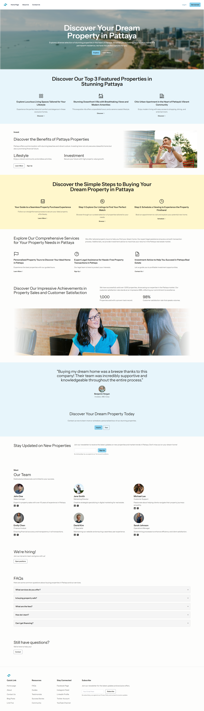

# Pproperty - Property Landing Page

A simple property landing page mockup built with Laravel Blade and Tailwind CSS.



## Built with

- Laravel
- Blade templates
- Tailwind CSS

## Getting it running

### Development environment

- Node.js: **v22.16.0**
- NPM: **v11.4.2**
- Composer: **v2.8.3**
- PHP: **v8.4.0**

1. **Clone it**
   ```bash
   git clone https://github.com/A-Sarayut/Pproperty.git
   cd Pproperty
   ```

2. **Install stuff**
   ```bash
   composer install
   npm install
   ```

3. **Set up environment**
   ```bash
   copy .env.example .env
   php artisan key:generate
   ```

4. **Database** (if you need it)
   ```bash
   php artisan migrate
   ```

5. **Build the CSS**
   ```bash
   npm run build
   ```

6. **Run it**
   ```bash
   composer run dev
   ```

## Note

This is just a mockup/demo project. It's not meant for production use - just for learning
